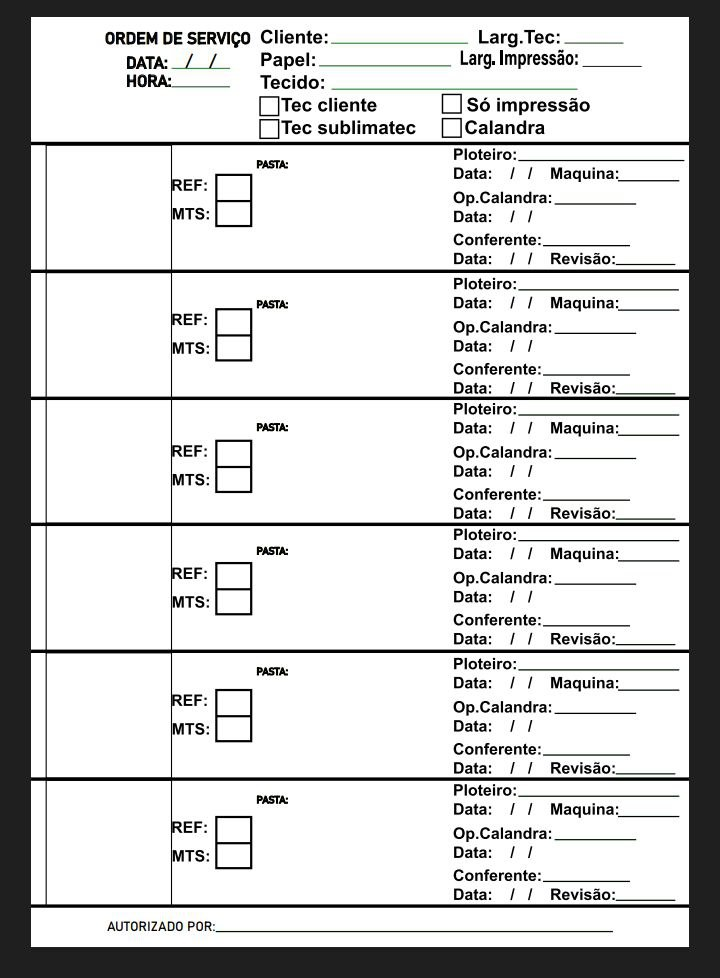

# 📌 Projeto: Ordem de Serviço  
*Disciplina: Programação Orientada a Objetos*

---

# 🔧 Sistema de Gerenciamento de Ordem de Serviço (Como inicializar aplicação feita na entrega 4)

## 📋 Índice
- [Visão Geral](#-visão-geral)
- [Pré-requisitos](#-pré-requisitos)
- [Configuração do Projeto](#-configuração-do-projeto)
- [Configuração no VS Code](#-configuração-no-vs-code)
- [Executando a Aplicação](#-executando-a-aplicação)
- [Usando a Aplicação](#-usando-a-aplicação)
- [Solução de Problemas](#-solução-de-problemas)

---

## 🎯 Visão Geral

Este guia te ajudará a configurar e executar o Sistema de Gerenciamento de Ordens de Serviço, uma aplicação Java que busca gerenciar as ordens de serviço.

---

## 🛠 Pré-requisitos

### ☕ Java Development Kit (JDK)
- *Versão recomendada:* JDK 21
- *Download:* [Oracle JDK](https://www.oracle.com) ou [Adoptium (Temurin)](https://adoptium.net)
- *Libs:* Junit Jupiter, BufferedImage   
- *Impressão:* Ter drivers de impressão

### 💻 Ambiente de Desenvolvimento

#### Opção 1: VS Code (Recomendado)
- *Editor:* [Visual Studio Code](https://code.visualstudio.com)
- *Extensão obrigatória:* Extension Pack for Java (Microsoft)

#### Opção 2: Outras IDEs
- IntelliJ IDEA
- Eclipse
- Ou linha de comando com javac e java
- Apertar no botão de play no Eclipse


---

## 📁 Configuração do Projeto

### 1. Obter o Código-fonte

#### Via Git:
bash
git clone https://github.com/Viniciusgithu/ordem_servico.git
cd ordem_servico


#### Via Download:
- Baixe o arquivo ZIP
- Extraia para uma pasta de sua preferência

### 2. Estrutura de Pastas
Organize seu projeto desta forma:


```text
ordemdeservico/
├── TextEditor/
│   ├── bin/
│   └── src/
│       ├── ImageUtils.java
│       ├── LinhaPanel.java
│       ├── Main.java
│       ├── OrdemServico.java
│       ├── PrintUtils.java
│       └── TextEditor.java
│   └── test/
├── .gitignore
└── README.md


## 🚀 Executando a Aplicação

### No VS Code:

#### 1. Compilar
- O VS Code compila automaticamente ao salvar
- Para forçar recompilação: Ctrl+Shift+P → "Java: Clean Java Language Server Workspace"

#### 2. Executar
1. Abra o arquivo Main.java
2. Vá para a aba *"Run and Debug"* (ícone de play com bug)
3. Selecione *"Executar Aplicação Principal (Main)"* no dropdown
4. Clique no botão ▶ verde ou pressione F5

A aplicação será iniciada e a interface gráfica será exibida.

---

## 📱 Usando a Aplicação

### Interface Principal
A aplicação abrirá com uma interface gráfica TextEditor onde você pode:

### ✨ Funcionalidades Principais:
- *Criar OS:* Preencha os campos da Ordem de Serviço
- *Adicionar Itens:* Configure Refs, Pastas, Mts e Imagens
- *Imprimir:* Arquivo > *Imprimir*
- *Nova OS:* Arquivo > *+Página*

---


---

*🎉 Pronto! Sua aplicação de Ordem de Serviço está configurada e funcionando!*

## Primeira Entrega

### 🧑‍💻 História do Usuário
- [Clique para visualizar a história do usuário](https://docs.google.com/document/d/1hoB7Cg6qycSNQD4wTxnoZE7-cdvidArfGntpcaNiHuY/edit?usp=sharing)

### 📝 Protótipo Lo-Fi
  
*Protótipo de baixa fidelidade da Ordem de Serviço*

---

## Segunda Entrega

### 🔄 Diagrama de Fluxo da Aplicação
- [Acessar no diagrams.net](https://app.diagrams.net/#G1E-pRuPGggS4K4_pIr3MP0-HpETo3arUx#%7B%22pageId%22%3A%22C5RBs43oDa-KdzZeNtuy%22%7D)


### 🎥 Screencast Legendado
- [Assistir ao vídeo com legenda](https://drive.google.com/file/d/1Vj0vaCYVrJ8Omm20w1lRwZ2vBlH6-zoA/view?usp=drive_link)

---

## Terceira Entrega

### 🧾 Histórias do Usuário (Atualizadas)
- [Visualizar documento](https://docs.google.com/document/d/1hoB7Cg6qycSNQD4wTxnoZE7-cdvidArfGntpcaNiHuY/edit?usp=sharing)

### 🎨 Protótipos de Telas (Figma)
- [Acessar protótipos no Figma](https://www.figma.com/design/sJFzhUsR7P8uujbX4RzHBm/Service_Order?node-id=1-9&t=dwtfHLBP6ZuvZv5J-1)

### 🧬 Diagrama de Classes
- [Ver diagrama no diagrams.net](https://app.diagrams.net/#G1E-pRuPGggS4K4_pIr3MP0-HpETo3arUx#%7B%22pageId%22%3A%22C5RBs43oDa-KdzZeNtuy%22%7D)


### 🧪 Screencast dos Testes Unitários
- [Assistir aos testes unitários](https://youtu.be/XaAEmypOHGs)

### 💻 Screencast da Aplicação Funcionando
- [Demonstração da aplicação em funcionamento](https://youtu.be/EbfuM371guU)

## Quarta Entrega

### 🧾 Histórias do Usuário (Atualizadas)
- [Visualizar documento](https://docs.google.com/document/d/14WKR6c2ouM5nqEZj5yV3sOeDF--C2tIPXqlO117ok5g/edit?pli=1&tab=t.0#heading=h.ar1ehal5hz80)

### 🎨 Protótipos de Telas (Figma)
- [Acessar protótipos no Figma](https://www.figma.com/design/sJFzhUsR7P8uujbX4RzHBm/Service_Order?node-id=1-9&t=dwtfHLBP6ZuvZv5J-1)

### 🧬 Diagrama de Classes
https://drive.google.com/file/d/1E-pRuPGggS4K4_pIr3MP0-HpETo3arUx/view?usp=sharing


### 🧪 Screencast dos Testes Unitários
- [Assistir aos testes unitários](https://youtu.be/zr4MBbZmanQ)

### 💻 Screencast da Aplicação Funcionando
- [Demonstração da aplicação em funcionamento](https://www.youtube.com/watch?v=vIvHYwFKUbs)

### 🐛 Bug Tracker


---

## 💡 Melhorias Futuras (Sugestões)
- API restful
- Integração com banco de dados
- Autenticação de usuários
- Responsividade para mobile
- Criação de relatórios exportáveis (PDF)
- Interface mais interativa com feedback visual

---

📍 *Projeto desenvolvido como parte da disciplina de Programação Orientada a Objetos – 2025.*
